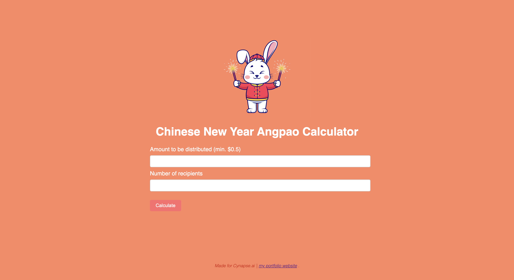
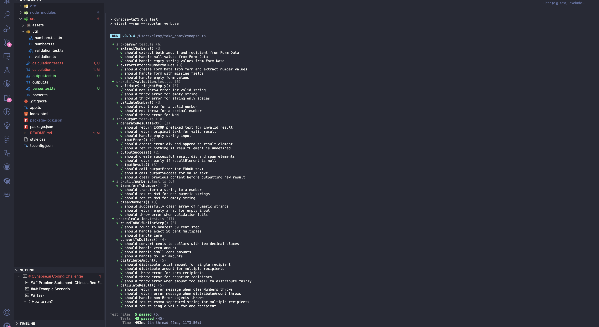

# Cynapse.ai Coding Challenge

### Problem Statement: Chinese Red Envelopes

In Chinese culture, it is popular to offer red envelopes (Angpao) for Chinese New Year. This beloved
tradition has been around for centuries.

However, in the past few years, red envelopes have been moved into popular mobile phone applications.
In addition to the traditional red envelope gifts, a popular mobile game has emerged: families use services
such as WeChat group red packets to distribute digital red envelopes to a group of family members or
friends. Money is distributed randomly to a group of friends or family members, and people are excited
to see the results.

### Example Scenario

User A wants to distribute **\$10** among **5 friends**. The system might split the amount like this:

- B: \$1, C: \$4, D: \$3, E: \$0.50, F: \$1.50

Each participant receives a random portion, and the results often spark excitement and surprise.

## Task

Write a program that:

- Takes an input amount and a number of recipients.
- Randomly allocates the total amount among all recipients.
- Ensures the total distributed amount matches the input amount.

## Application Demo



Watch the demo here! **[Link to demo video](https://vimeo.com/1100967952?share=copy)**

## Screenshot of Test cases



## How to run?

### Prerequisites

```bash
node v22.14.0
npm install
```

### Available Commands

```bash
# Start development server, on http://localhost:8080
npm run start

# Run all test cases
npm run test

# Build for production
npm run build
```
